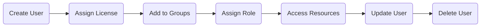

# Create, Configure, and Manage Identities (Part 1 - Users & Groups)

> **Certification:** AZ-104 - Microsoft Identity and Access Administrator Associate
>
> **Module:** Create, Configure, and Manage Identities
>
> **Part 1:** Users, Groups, User Lifecycle, Password Management & Group Management

---

# Table of Contents

- Microsoft Entra ID Overview
- Identity Types
- User Management
- User Types
- User Lifecycle
- User Properties
- User Operations
- Password Management
- Self-Service Password Reset (SSPR)
- Bulk User Management
- Group Management
- Security Groups
- Microsoft 365 Groups
- Dynamic Groups
- Membership Types
- Nested Groups
- Group Expiration
- Naming Policy
- Exam Tips

---

# Microsoft Entra ID Overview

Microsoft Entra ID (formerly Azure Active Directory) is Microsoft's cloud-based Identity and Access Management (IAM) service.

It provides:

- Authentication
- Authorization
- Identity Protection
- Single Sign-On (SSO)
- Access Management

Simply put,

> Microsoft Entra ID answers **"Who are you?"**

while Azure RBAC answers

> **"What are you allowed to do?"**

---

# Identity Types

Microsoft Entra stores different types of identities.

| Identity | Description |
|------------|------------|
| User | Represents a person |
| Group | Collection of users |
| Device | Laptop, Phone, Tablet |
| Service Principal | Identity for an application |
| Managed Identity | Identity for Azure Resources |

Example

```
Microsoft Entra ID

│

├── Users

├── Groups

├── Devices

├── Applications

└── Managed Identities
```

---

# User Management

A User is an identity that can authenticate and access Microsoft cloud resources.

Examples

- Employee
- Administrator
- Contractor
- Student

Example

```
Heer Patel

↓

Microsoft Entra Authentication

↓

Teams

↓

Outlook

↓

Azure Portal

↓

Microsoft 365
```

---

# User Types

Microsoft Entra supports three major user types.

---

## 1. Cloud User

Cloud Users exist only in Microsoft Entra ID.

Example

```
Microsoft Entra

↓

heer@contoso.com
```

Characteristics

- Created directly in Entra ID
- Managed from Entra Admin Center
- No Active Directory dependency
- Password stored in cloud

Best For

- Cloud-only organizations

---

## 2. Directory Synchronized User

Created inside

```
Active Directory
```

Then synchronized to Microsoft Entra.

Architecture

```
Active Directory

↓

Microsoft Entra Connect

↓

Microsoft Entra ID
```

Characteristics

- Managed in Active Directory
- Automatically synchronized
- Hybrid Environment

Examples

Large enterprises

Banks

Universities

Government

---

### Source of Authority

This is a very important AZ-104 concept.

Cloud User

```
Source of Authority

↓

Microsoft Entra
```

Synchronized User

```
Source of Authority

↓

Active Directory
```

Never edit synchronized user attributes directly in Entra.

---

## 3. Guest User (Azure AD B2B)

Guest users are external identities.

Example

```
Vendor

↓

john@gmail.com

↓

Invitation

↓

Microsoft Teams

↓

SharePoint
```

Guest users authenticate using their own organization's credentials.

Common Use Cases

- Vendors
- Consultants
- Clients
- Partners

---

# User Lifecycle

Every user follows a lifecycle.



---

# User Properties

Each user contains multiple attributes.

| Property | Description |
|------------|------------|
| Display Name | Full Name |
| User Principal Name (UPN) | Login ID |
| Mail | Email Address |
| Department | User Department |
| Job Title | Position |
| Company Name | Organization |
| Manager | Reporting Manager |
| Office Location | Office Address |
| Usage Location | Required for Licensing |

---

# User Principal Name (UPN)

UPN is used during authentication.

Format

```
username@domain.com
```

Example

```
heer@contoso.com
```

UPN must be unique inside the tenant.

---

# Common User Operations

Administrators can perform the following tasks.

- Create Users
- Update Users
- Delete Users
- Restore Deleted Users
- Reset Password
- Block Sign-in
- Assign Licenses
- Assign Roles

---

# Soft Delete vs Hard Delete

## Soft Delete

Deleted users remain recoverable for 30 days.

```
Delete User

↓

Deleted Users

↓

Restore
```

---

## Hard Delete

After 30 days

OR

Permanent deletion

↓

Cannot Restore

---

# Block Sign-in

Instead of deleting a user, administrators can block sign-in.

Example

Employee resigns today.

Instead of deleting

↓

Block Sign-in

↓

Access Immediately Revoked

Useful when

- Employee on Leave
- Investigation
- Notice Period

---

# Password Management

Administrators can

- Reset Password
- Require Password Change
- Unlock Accounts
- Enable SSPR

---

# Self-Service Password Reset (SSPR)

Allows users to reset passwords without contacting IT.

Authentication Methods

- Microsoft Authenticator
- SMS
- Email
- Security Questions

Flow


Benefits

- Reduced Helpdesk Calls
- Faster Recovery
- Better User Experience

---

# Bulk User Management

Instead of creating users individually,

Microsoft Entra supports bulk operations.

Supported Operations

- Bulk Create
- Bulk Delete
- Bulk Invite
- Bulk Update

Usually performed using

- CSV Files
- PowerShell
- Microsoft Graph API

---

# Group Management

Groups simplify administration.

Without Groups

```
Admin

↓

Assign License

↓

User1

↓

User2

↓

User3
```

With Groups

```
Admin

↓

Sales Group

↓

Everyone Gets License
```

---

# Types of Groups

Microsoft Entra provides two primary group types.

---

## Security Groups

Used for

- Permissions
- Conditional Access
- Licensing
- RBAC

Example

```
IT Admin Group

↓

Storage Access

↓

Key Vault Access

↓

Virtual Machines
```

---

## Microsoft 365 Groups

Used for collaboration.

Automatically creates

- Teams
- Planner
- Outlook Group
- SharePoint Site
- OneNote Notebook

Example

```
Marketing Team

↓

Microsoft Teams

↓

Shared Calendar

↓

Shared Mailbox
```

---

# Membership Types

---

## Assigned Membership

Administrator manually adds users.

```
Admin

↓

Add Heer

↓

Add John

↓

Done
```

---

## Dynamic Membership

Membership is determined automatically.

Example Rule

```
Department = IT
```

Everyone whose department equals IT automatically joins.

Benefits

- No Manual Work
- Automatic Updates
- Large Organizations

---

# Nested Groups

A group inside another group.

Example

```
IT Group

↓

Developers

↓

Azure Admins
```

Not every Microsoft service supports nested groups.

Always verify service compatibility.

---

# Group Expiration

Organizations can automatically expire groups.

Purpose

- Remove unused groups
- Reduce clutter
- Improve governance

Example

365 Days

↓

Group Expires

↓

Owner Receives Renewal Email

---

# Group Naming Policy

Automatically enforces naming conventions.

Example

```
Department_GroupName

IT_Admins

HR_Recruitment

Finance_Payroll
```

Benefits

- Standardization
- Easy Search
- Better Governance

---

# Security Group vs Microsoft 365 Group

| Feature | Security Group | Microsoft 365 Group |
|------------|----------------|---------------------|
| Permissions | ✅ | ❌ |
| Licensing | ✅ | ❌ |
| Conditional Access | ✅ | ❌ |
| Email | ❌ | ✅ |
| Teams | ❌ | ✅ |
| Planner | ❌ | ✅ |
| SharePoint | ❌ | ✅ |

---

# Best Practices

✅ Use Dynamic Groups whenever possible.

✅ Use Security Groups for permissions.

✅ Use Microsoft 365 Groups for collaboration.

✅ Use SSPR to reduce helpdesk workload.

✅ Never modify synchronized users directly in Entra.

---

# AZ-104 Exam Tips

### Remember

Cloud User

→ Managed in Entra ID

Synchronized User

→ Managed in Active Directory

Guest User

→ External Identity

---

Security Group

→ Permissions

Microsoft 365 Group

→ Collaboration

---

Dynamic Group

→ Automatic Membership

Assigned Group

→ Manual Membership

---

Deleted User

→ Recoverable for 30 Days

---

UPN

→ Used for Login

---

SSPR

→ Users Reset Their Own Password

---

# Quick Revision

| Concept | Remember |
|-----------|----------|
| Cloud User | Exists only in Entra |
| Synced User | Managed from AD |
| Guest User | External User |
| UPN | Login Name |
| Security Group | Permissions |
| Microsoft 365 Group | Collaboration |
| Dynamic Membership | Automatic |
| Assigned Membership | Manual |
| Soft Delete | 30 Days Recovery |
| SSPR | Users Reset Passwords |
